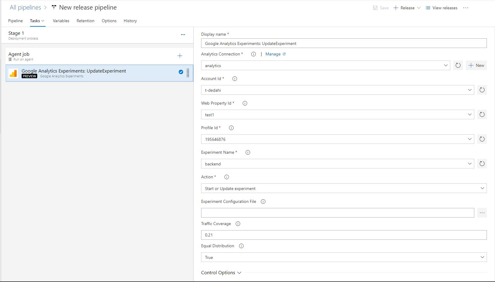
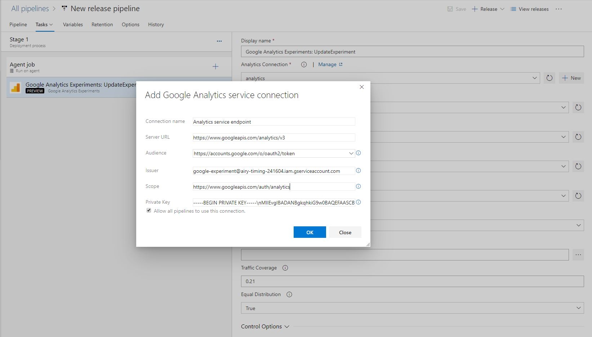

# Google Analytics
Google Analytics lets you measure your advertising ROI as well as track your Flash, video, and social networking sites and applications. The Google Analytics experiments framework enables you to test almost any change or variation to a website or app to see how it performs in optimizing for a specific goal.
To get started:

1) [ Get started with Analytics](https://support.google.com/analytics/answer/1008015?hl=en)
2) [ Experiments - Articles & Solutions](https://developers.google.com/analytics/solutions/experiments)


# Overview
Google Analytics Experiment extension for azure devops lets you start, stop and update your experiments in minimal steps. This extension provides you two ways of making changes -

* by entering changes into provided fields in task.
* by adding a json file with proper [schema](https://aka.ms/googleanalyticsexperimentschema)

# Prerequisite
Before using the extension we need to configure google account in order to get JWT config file.

* Visit https://console.developers.google.com/ and register your app as new application with google.
* Select the Google Analytics Api from Library.
* Create service account key and obtain json credentials.
* Add the client email from json file as a user in google analytics User Management and provide necessary access.

## Manage experiments with Azure Pipelines
Start or stop an experiment, assign traffic coverage and set traffic distribution method using the task in Azure Pipelines.

* Search for "Google Analytics Experiments" and click on "Add"



* Now you need to configure the connection to your "Google" account. Click on "+ New" button on the "Google Analytics service connection" field on the right pane
* In the new connection dialog, enter a name for the connection and other four field related to your google account.
    * Issuer - client_email
    * Audience - "https://accounts.google.com/o/oauth2/token"
    * Scope - use this "https://www.googleapis.com/auth/analytics" (without quotes). This scope provide top level access. For specific access level [visit here.](https://developers.google.com/analytics/devguides/config/mgmt/v3/mgmtReference/management/experiments)
    * Private Key - private_key



* Choose proper account Id , Web Property Id and profile Id from drop down menus.
* Select which experiment to update.
* Select suitable action from the drop down menu.
* Next enter all the variation you want to make in the above selected experiment either from a configuration file or by using below provided input boxes.

NOTE- In case of conflict between config file and textbox inputs, inputs provided in textbox will override the data provided in config file.

A sample for config file
```json

{
   "id":"uk4SC_5ASfO0HyPwP-jWEQ",
   "objectiveMetric":"ga:pageviews",
   "minimumExperimentLengthInDays":32,
}
```
For more info on config file please visit [here](https://developers.google.com/analytics/devguides/config/mgmt/v3/mgmtReference/management/experiments)
